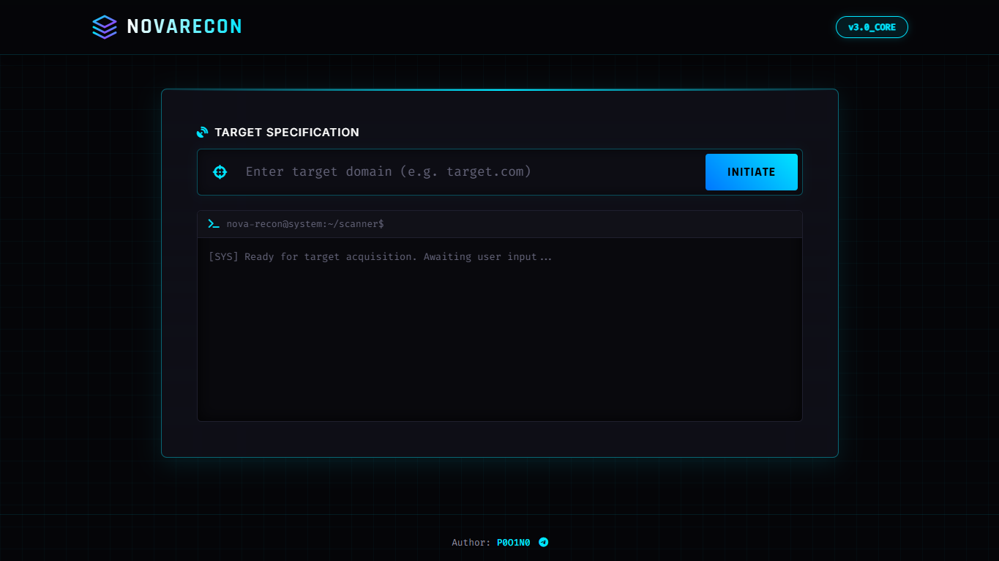

# NovaRecon – Web Intelligence Scanner

A modular reconnaissance framework for automated endpoint discovery, security analysis, and identifier intelligence gathering.

## Overview

NovaRecon performs automated reconnaissance against web targets, extracting infrastructure metadata, discovering API endpoints, analysing security configurations, and hunting for exposed numeric identifiers. Results are delivered through a real‑time web dashboard with progress tracking and log streaming.

## Core Capabilities

| Module | Description |
|---|---|
| **Infrastructure Recon** | DNS resolution, server header inspection, SSL certificate validation |
| **Asset Discovery** | Endpoint extraction from JavaScript, directory brute‑forcing, sensitive file detection |
| **Vulnerability Scanning** | Security header audit, CORS misconfiguration detection, directory listing checks |
| **ID Intelligence** | Numeric ID hunting across API endpoints, sequential pattern analysis, entropy measurement, record count estimation |
| **Growth Monitoring** | Periodic endpoint sampling, trend tracking, and predictive analytics for ID‑based resources |

## Architecture

```
NovaRecon/
├── NovaRecon.py          # Single entry point – handles dependency installation and server launch
├── core/
│   ├── __init__.py
│   ├── config.py         # User agents, wordlists, classification patterns
│   ├── utils.py          # Helper functions: entropy calculation, Selenium rendering, logging
│   └── scanner.py        # Main engine class: all reconnaissance and analysis logic
└── web/
    ├── __init__.py
    ├── templates.py      # Dashboard HTML, CSS, and JavaScript
    └── server.py         # Flask application with SocketIO event handlers
```

Scanning runs on background threads via Eventlet, streaming progress and log updates to the frontend over WebSockets.

## Quick Start

**Prerequisites:** Python 3.8+

```bash
git clone https://github.com/P0O1N0/NovaRecon.git
cd NovaRecon
python NovaRecon.py
```

The script automatically installs required packages (Flask-SocketIO, Requests, BeautifulSoup4, Selenium, NumPy, etc.) and opens the dashboard at `http://127.0.0.1:5000`.

## Usage

1. Enter a target domain in the input field and click **INITIATE**.
2. Monitor real‑time logs and progress during the scan.
3. Review results across six panels:
   - **Security Scores** – Aggregated metrics for security posture, data exposure, and ID reliability
   - **Infrastructure** – IP, server technology, HTTP status
   - **SSL & Cryptography** – Certificate validity, issuer, expiry
   - **Vulnerability Assessment** – Missing headers, CORS issues, security header matrix
   - **ID Intelligence** – Pattern analysis, gap distribution, entropy, record estimation
   - **Discovered Assets** – Endpoints, emails, social media links
4. Use the **Live Telemetry Monitor** to track ID growth on specific endpoints over time.

## Dependencies

Installed automatically on first run:

- `flask`, `flask-socketio`, `eventlet` – Web server and real‑time communication
- `requests`, `beautifulsoup4` – HTTP client and HTML parsing
- `selenium`, `webdriver-manager` – Headless browser for SPA rendering
- `numpy` – Statistical analysis for ID patterns
- `colorama` – Terminal output formatting

## Configuration

Wordlists and detection patterns are defined in `core/config.py`:

- `COMMON_DIRS` – Directory paths to brute‑force
- `SENSITIVE_FILES` – Files to probe for information disclosure
- `COMMON_ACTION_NAMES` – Payload values for POST parameter fuzzing
- `CLASS_PATTERNS` – Keyword mappings for endpoint classification

## Limitations

- Headless browser (Selenium) requires Chrome/Chromium installed
- Large target sites may hit the 25‑endpoint probe limit per scan
- Growth monitoring accuracy depends on consistent ID sequencing
- Not a substitute for comprehensive vulnerability scanners

## Contributing

Bug reports, feature requests, and pull requests are welcome. Please ensure code follows the existing modular structure.

## Disclaimer

This tool is intended for authorised security testing only. Users are responsible for obtaining proper permission before scanning any target system.




